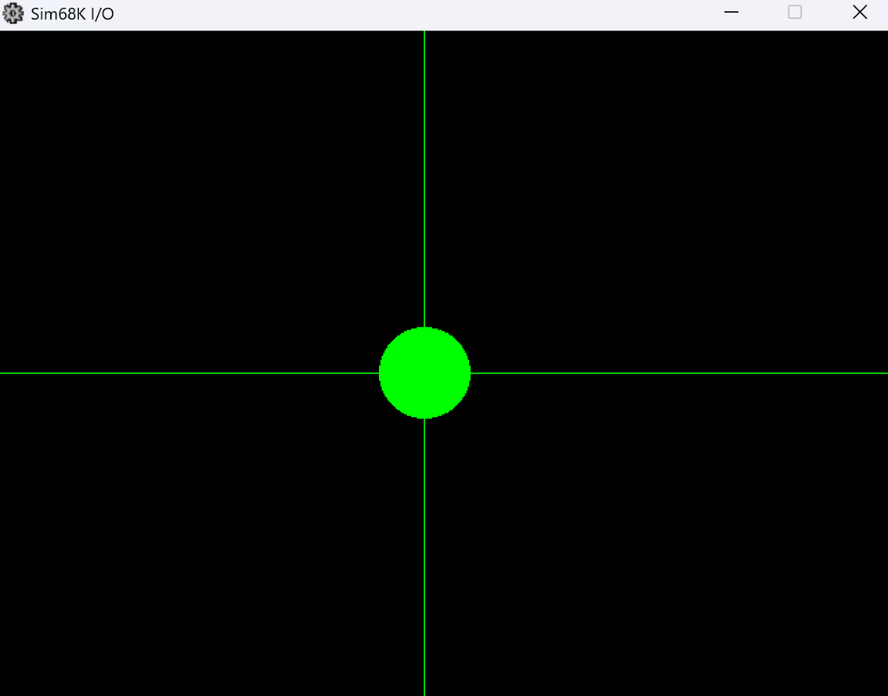
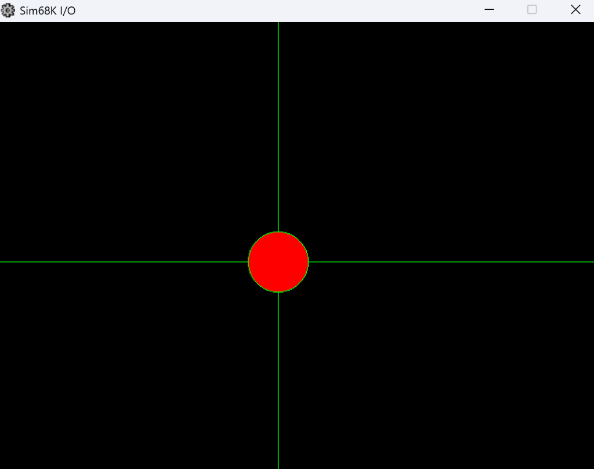

 
 # Práctica 2: Acceso a periféricos con soporte del sistema e interrupciones

Este repositorio contiene la solución a la Práctica 2B de la asignatura **Estructura de Computadores II**. El objetivo de esta práctica es programar en lenguaje ensamblador del microprocesador **MC68000** utilizando el entorno **EASy68K**, aplicando conceptos de acceso a periféricos con soporte del sistema e interrupciones.

## Descripción del Proyecto (PRAC2B)

El programa muestra un círculo en la ventana gráfica que interactúa con el usuario a través del ratón:
- **Movimiento**: El centro del círculo sigue en todo momento la posición del cursor del ratón.
- **Interacción (Clic)**: El color del círculo cambia dependiendo del estado del botón izquierdo del ratón:
  - Si no está pulsado: Interior y contorno verdes.
  - Si está pulsado: Interior rojo con contorno verde.

### Demostración Gráfica

| Sin Clic Izquierdo (Verde) | Con Clic Izquierdo (Rojo) |
|:---:|:---:|
|  |  |

Adicionalmente, dependiendo del grupo de desarrollo, se incluyen efectos de sonido cuando el círculo toca los bordes de la ventana (arriba, abajo, derecha, izquierda) y al realizar un clic.

## Archivos Incluidos

- \PRAC2B.X68\: Programa principal que inicializa y gestiona la ejecución.
- \SUBRTN.X68\: Archivo de subrutinas que contiene la lógica principal desarrollada para controlar la interacción del ratón, redibujado de gráficos, gestión de interrupciones y reproducción de sonidos.
- \PRAC2B.mp4\: Vídeo demostrativo del funcionamiento esperado del programa.
- \sin_click.png\ y \con_click.png\: Imágenes demostrativas del funcionamiento de la ventana gráfica.

## Requisitos

- Entorno de simulación **EASy68K** para ejecutar código ensamblador del MC68000.

## Ejecución

1. Cargar el archivo \PRAC2B.X68\ en el entorno EASy68K.
2. Ensamblar y ejecutar el programa.
3. Interactuar con la ventana de E/S gráfica (I/O) utilizando el ratón para comprobar el comportamiento descrito.

---
*Práctica de 2º año, 1r cuatrimestre.*
